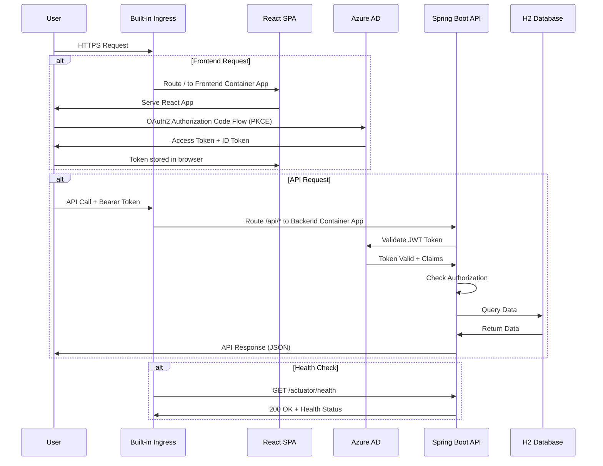
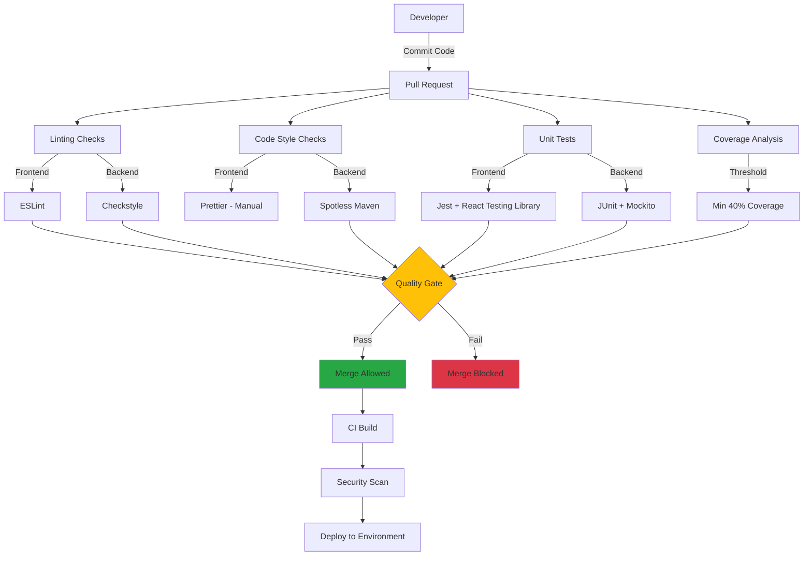
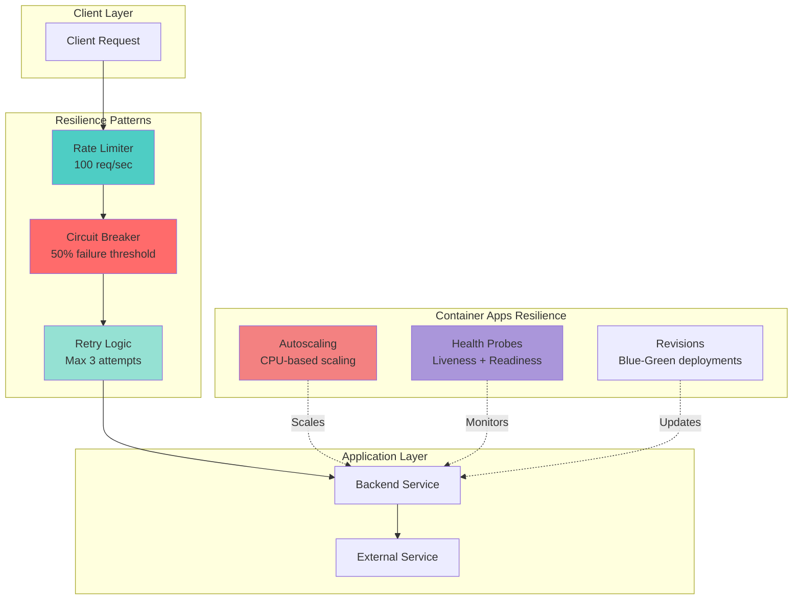
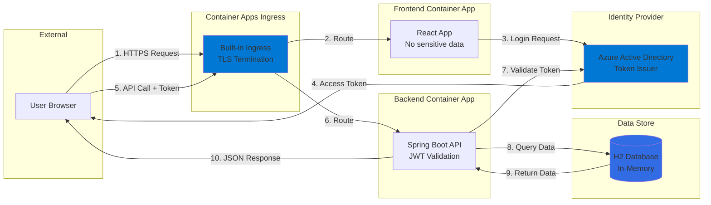

# Technical Architecture

## Overview

This document describes the technical architecture of the Azure Container Apps Starter Kit, a production-ready cloud-native application built on Azure Container Apps. The architecture follows Azure Well-Architected Framework principles and implements enterprise-grade security, reliability, and operational excellence.

---

## High-Level Architecture

```mermaid
graph TB
    subgraph "User Layer"
        User[End User Browser]
    end

    subgraph "Azure Cloud"
        subgraph "Identity & Access"
            AAD[Azure Active Directory]
        end

        subgraph "CI/CD Pipeline"
            GHA[GitHub Actions]
            ACR[Azure Container Registry]
        end

        subgraph "Azure Container Apps Environment"
            subgraph "Ingress Layer"
                ING[Built-in Ingress]
                CM[cert-manager (optional for custom certs)]
            end

            subgraph "Application Layer"
                FE[Frontend Container App<br/>React SPA]
                BE[Backend Container App<br/>Spring Boot API]
            end

            subgraph "Data Layer"
                H2[H2 Database<br/>In-Memory]
            end
        end

        subgraph "Monitoring & Observability"
            ACT[Actuator Endpoints]
            PROM[Prometheus Metrics]
        end
    end

    User -->|HTTPS| ING
    ING -->|Route /| FE
    ING -->|Route /api/*| BE

    FE -->|OAuth2 PKCE| AAD
    BE -->|JWT Validation| AAD
    FE -->|API Calls + Bearer Token| BE
    BE --> H2

    GHA -->|Build & Push Images| ACR
    GHA -->|Deploy Revisions| FE
    GHA -->|Deploy Revisions| BE

    BE --> ACT
    ACT --> PROM
    CM -->|Issue TLS Certs (if needed)| ING

    style AAD fill:#0078D4
    style ACR fill:#0078D4
    style ING fill:#0078D4
```

---

## Detailed Application Flow



---

## CI/CD Pipeline Architecture

```mermaid
graph LR
    subgraph "Source Control"
        GH[GitHub Repository<br/>main/develop branches]
    end

    subgraph "Build Pipeline"
        BFE[Frontend Build<br/>npm test + build]
        BBE[Backend Build<br/>mvn test + package]
        SCAN[Security Scan<br/>Trivy + CodeQL]
    end

    subgraph "Artifact Storage"
        ACR[Azure Container Registry<br/>Docker Images]
    end

    subgraph "Deployment Pipeline"
        DEV[Deploy to Dev<br/>develop branch]
        STAGE[Deploy to Stage<br/>manual approval]
        PROD[Deploy to Prod<br/>manual approval]
    end

    subgraph "Quality Gates"
        QG1[Code Coverage ≥ 40%]
        QG2[Security Scan Pass]
        QG3[Code Style Check]
        QG4[Unit Tests Pass]
    end

    GH -->|Push/PR| BFE
    GH -->|Push/PR| BBE
    BFE --> QG1
    BFE --> QG3
    BFE --> QG4
    BBE --> QG1
    BBE --> QG3
    BBE --> QG4
    QG1 --> SCAN
    QG3 --> SCAN
    QG4 --> SCAN
    SCAN --> QG2
    QG2 --> ACR
    ACR --> DEV
    DEV --> STAGE
    STAGE --> PROD

    style QG1 fill:#28a745
    style QG2 fill:#28a745
    style QG3 fill:#28a745
    style QG4 fill:#28a745
```



---

## Security Layers

### 1. **Identity & Access Management**
- **Azure Active Directory (AAD)** integration for authentication
- **OAuth 2.0 Authorization Code Flow with PKCE** for frontend
- **JWT Bearer Token validation** for backend APIs
- **Role-Based Access Control (RBAC)** via AAD groups and claims

### 2. **Network Security**
- **Built-in Ingress** for L7 routing and TLS termination
- **TLS 1.2+** encryption with managed certificates or Let's Encrypt (prod)
- **IP-based access** with optional IP allow lists
- **Dapr sidecars** (optional) for service-to-service communication

### 3. **Application Security**
- **JWT token validation** on every API request
- **OAuth2 Resource Server** configuration with audience validation
- **CORS policies** configured per environment
- **Security headers** via ingress configurations
- **Secrets management** via Container Apps secrets

### 4. **Container Security**
- **Trivy vulnerability scanning** on every Docker image build
- **Non-root container execution** with security contexts
- **Read-only root filesystem** where applicable
- **Resource limits** to prevent resource exhaustion attacks
- **Image signing** via ACR (can be enabled)

### 5. **Code Security**
- **GitHub CodeQL** static analysis on every PR
- **Dependency scanning** via npm audit and Maven dependency-check
- **Security-focused code reviews** enforced via branch protection
- **OWASP Top 10** awareness in development practices
- **No hardcoded secrets** - all credentials via GitHub Secrets

### 6. **Pipeline Security**
- **Branch protection rules** on main/develop branches
- **Required PR reviews** before merge
- **Status checks** must pass before deployment
- **Environment approvals** for stage/prod deployments
- **Audit logs** via GitHub Actions history

---

## Code Quality Governance



### Quality Standards

#### **Frontend (React + TypeScript)**
- **ESLint**: JavaScript/TypeScript linting with React rules
- **Code Coverage**: Minimum 40% line coverage (configurable to 70%)
- **Testing**: Jest + React Testing Library
- **Build Validation**: Production build must succeed
- **Type Safety**: TypeScript strict mode (can be enabled)

#### **Backend (Spring Boot + Java)**
- **Checkstyle**: Google Java Style Guide enforcement
- **Spotless**: Automatic code formatting with fail-on-error
- **Code Coverage**: Minimum 40% across lines, branches, functions
- **Testing**: JUnit 5 + Mockito + Spring Boot Test
- **Static Analysis**: SonarQube integration ready

#### **Docker Images**
- **Multi-stage builds** for minimal image size
- **Trivy scanning** for vulnerabilities (CRITICAL + HIGH)
- **Layer caching** for faster builds
- **No unnecessary packages** in production images

---

## Application Resilience



### Resilience Mechanisms

#### **1. Circuit Breaker (Resilience4j)**
```yaml
Configuration:
  - Sliding Window Size: 10 requests
  - Failure Rate Threshold: 50%
  - Wait Duration in Open State: 10 seconds
  - Half-Open Permitted Calls: 3
```

#### **2. Retry Policy**
```yaml
Configuration:
  - Max Attempts: 3
  - Wait Duration: 1 second
  - Retry Exceptions: IOException, TimeoutException
```

#### **3. Rate Limiting**
```yaml
Configuration:
  - Limit per Period: 100 requests
  - Period: 1 second
  - Timeout: Fail immediately
```

#### **4. Container Apps Health Checks**
- **Liveness Probe**: Detects if container is alive (restart if failing)
- **Readiness Probe**: Detects if container is ready for traffic
- **Startup Probe**: Allows slow-starting containers

#### **5. Autoscaling**
```yaml
Dev Environment:
  - Min Replicas: 2
  - Max Replicas: 5
  - Target CPU: 70%

Production Environment:
  - Min Replicas: 3
  - Max Replicas: 15
  - Target CPU: 70%
```

#### **6. Revisions**
```yaml
Strategy:
  - Traffic Splitting: Blue-Green or Canary
  - Ensures zero-downtime deployments
```

---

## Azure Well-Architected Framework Alignment

### 🎯 **1. Reliability**

| Principle | Implementation |
|-----------|----------------|
| **Design for failure** | Circuit breakers, retries, fallback mechanisms |
| **High availability** | Multi-replica deployments (2-15 replicas) |
| **Self-healing** | Container Apps liveness/readiness probes with auto-restart |
| **Disaster recovery** | Infrastructure as Code (ARM/Bicep/Terraform) for quick recreation |
| **Health monitoring** | Actuator endpoints + Prometheus metrics |

### 🔒 **2. Security**

| Principle | Implementation |
|-----------|----------------|
| **Defense in depth** | 6-layer security model (see Security Layers) |
| **Least privilege** | Managed identities for services, minimal container permissions |
| **Identity-based access** | Azure AD OAuth2 authentication + JWT authorization |
| **Encryption** | TLS in transit, secrets encrypted at rest |
| **Vulnerability management** | Trivy scanning on every build, CodeQL analysis |

### 💰 **3. Cost Optimization**

| Principle | Implementation |
|-----------|----------------|
| **Right-sizing** | Autoscaling scales down to min replicas during low traffic |
| **Resource limits** | CPU/memory limits prevent over-provisioning |
| **Efficient builds** | Docker layer caching reduces build time and costs |
| **Spot instances** | Can use Azure Spot VMs for non-prod (not configured) |
| **Environment-specific sizing** | Dev (2 replicas) vs Prod (3-15 replicas) |

### ⚡ **4. Performance Efficiency**

| Principle | Implementation |
|-----------|----------------|
| **Horizontal scaling** | Autoscaling based on CPU metrics |
| **Caching** | Docker layer caching, Maven/npm dependency caching |
| **CDN** | Can integrate Azure CDN for static assets (not configured) |
| **Database optimization** | Connection pooling, query optimization |
| **Load balancing** | Built-in ingress for traffic distribution |

### 🔧 **5. Operational Excellence**

| Principle | Implementation |
|-----------|----------------|
| **IaC** | ARM templates or Bicep for declarative infrastructure |
| **CI/CD automation** | GitHub Actions with multi-stage pipelines |
| **Monitoring** | Actuator health endpoints, Prometheus metrics |
| **Automated testing** | Unit tests, coverage thresholds, security scans |
| **Rollback capability** | Revision rollback, immutable image tags |
| **Documentation** | Inline code docs, architecture diagrams, README files |

---

## Technology Stack

### **Frontend**
- **Framework**: React 18.2
- **Authentication**: @azure/msal-react 2.0
- **HTTP Client**: Axios 1.6
- **Routing**: React Router 6.20
- **Build Tool**: Create React App (react-scripts 5.0)
- **Testing**: Jest + React Testing Library
- **Linting**: ESLint

### **Backend**
- **Framework**: Spring Boot 3.2.1
- **Language**: Java 17
- **Authentication**: Spring Security OAuth2 Resource Server
- **Resilience**: Resilience4j (Circuit Breaker, Retry, Rate Limiter)
- **Database**: H2 (in-memory, production-ready options: PostgreSQL, MySQL)
- **Monitoring**: Spring Boot Actuator + Micrometer Prometheus
- **Build Tool**: Maven 3.9
- **Testing**: JUnit 5 + Mockito + Spring Boot Test

### **Infrastructure**
- **Container Orchestration**: Azure Container Apps
- **Ingress**: Built-in Container Apps Ingress
- **TLS Management**: Managed certificates or cert-manager (optional)
- **Container Registry**: Azure Container Registry (ACR)
- **Package Manager**: None (direct deployments via Azure CLI or GitHub Actions)

### **CI/CD**
- **Pipeline**: GitHub Actions
- **Security Scanning**: Trivy (container), CodeQL (code)
- **Deployment Strategy**: Revisions with traffic splitting

### **Observability**
- **Metrics**: Prometheus
- **Health Checks**: Spring Boot Actuator
- **Logging**: Console logs (can integrate Azure Monitor)

---

## Deployment Architecture by Environment

### **Development (dev)**
```yaml
Frontend:
  - Replicas: 2
  - Resources: Default (requests/limits not set)
  - Autoscaling: Disabled

Backend:
  - Replicas: 2
  - Resources: Default
  - Autoscaling: Disabled

Ingress:
  - TLS: Managed certificates
  - Access: IP-based (no domain required)

Deployment Trigger:
  - Automatic on push to develop branch
  - After both build workflows pass
```

### **Staging (stage)**
```yaml
Frontend:
  - Replicas: 3
  - Resources: Default
  - Autoscaling: Disabled

Backend:
  - Replicas: 3
  - Resources: Default
  - Autoscaling: Disabled

Ingress:
  - TLS: Managed or Let's Encrypt
  - Access: Domain-based or IP-based

Deployment Trigger:
  - Manual via workflow_dispatch
  - Requires dev deployment success
```

### **Production (prod)**
```yaml
Frontend:
  - Replicas: 5 (initial)
  - Autoscaling: 3-10 replicas based on CPU
  - Resources:
      Requests: 256Mi memory, 250m CPU
      Limits: 512Mi memory, 500m CPU

Backend:
  - Replicas: 5 (initial)
  - Autoscaling: 3-15 replicas based on CPU
  - Resources:
      Requests: 512Mi memory, 500m CPU
      Limits: 1Gi memory, 1000m CPU

Ingress:
  - TLS: Managed certificates
  - Access: Domain-based with CDN

Deployment Trigger:
  - Manual via workflow_dispatch
  - Requires stage deployment success
  - Environment protection rules
```

---

## Data Flow & Security



### Security Controls per Layer

| Layer | Security Controls |
|-------|-------------------|
| **Ingress** | TLS termination, Rate limiting, IP allow lists |
| **Frontend** | CSP headers, XSS protection, no sensitive data storage |
| **Backend** | JWT validation, Input validation, SQL injection prevention |
| **Database** | In-memory (dev), Encrypted at rest (prod), Access controls |
| **Secrets** | Container Apps secrets |

---

## Monitoring & Observability

### **Application Health**
```yaml
Endpoints:
  - /actuator/health: Overall health status
  - /actuator/health/liveness: Liveness probe
  - /actuator/health/readiness: Readiness probe
  - /actuator/info: Application metadata
  - /actuator/metrics: Prometheus metrics
```

### **Key Metrics Tracked**
- **Request Rate**: Requests per second per endpoint
- **Error Rate**: 4xx and 5xx responses
- **Response Time**: P50, P95, P99 latencies
- **Resource Usage**: CPU, memory per replica
- **Circuit Breaker State**: Open/closed/half-open
- **Database Connections**: Pool size and active connections

### **Health Probe Configuration**
```yaml
Liveness:
  - Path: /actuator/health/liveness
  - Initial Delay: 30s
  - Period: 10s
  - Timeout: 5s

Readiness:
  - Path: /actuator/health/readiness
  - Initial Delay: 10s
  - Period: 5s
  - Timeout: 3s
```

---

## Future Enhancements

### **Security**
- [ ] Azure Key Vault integration for secrets management
- [ ] Azure Policy enforcement for compliance
- [ ] Dapr for secure service-to-service communication
- [ ] Web Application Firewall (WAF) via Azure Application Gateway

### **Observability**
- [ ] Azure Monitor / Application Insights integration
- [ ] Distributed tracing with OpenTelemetry
- [ ] Centralized logging with Azure Log Analytics
- [ ] Custom dashboards for business metrics

### **Performance**
- [ ] Azure CDN for static asset delivery
- [ ] Redis cache for session management
- [ ] Azure Database for PostgreSQL (replace H2)
- [ ] Connection pooling optimization

### **Reliability**
- [ ] Multi-region deployment for disaster recovery
- [ ] Azure Front Door for global load balancing
- [ ] Automated backup and restore procedures
- [ ] Chaos engineering with Azure Chaos Studio

### **Cost Optimization**
- [ ] Azure Spot VMs for non-production environments
- [ ] Reserved instances for predictable workloads
- [ ] Cost analysis and optimization recommendations
- [ ] Automated scaling policies based on business metrics

---

## Conclusion

This architecture demonstrates a production-ready, cloud-native application that:

✅ **Scales horizontally** based on demand (2-15 replicas)
✅ **Secures at every layer** with Azure AD, TLS, and container scanning
✅ **Maintains high availability** through health checks and auto-healing
✅ **Enforces code quality** with automated testing and coverage thresholds
✅ **Deploys safely** with revisions and environment protection
✅ **Monitors proactively** with health endpoints and metrics
✅ **Follows Azure best practices** aligned with Well-Architected Framework

The architecture is designed to be **extensible**, **maintainable**, and **production-ready** from day one.
